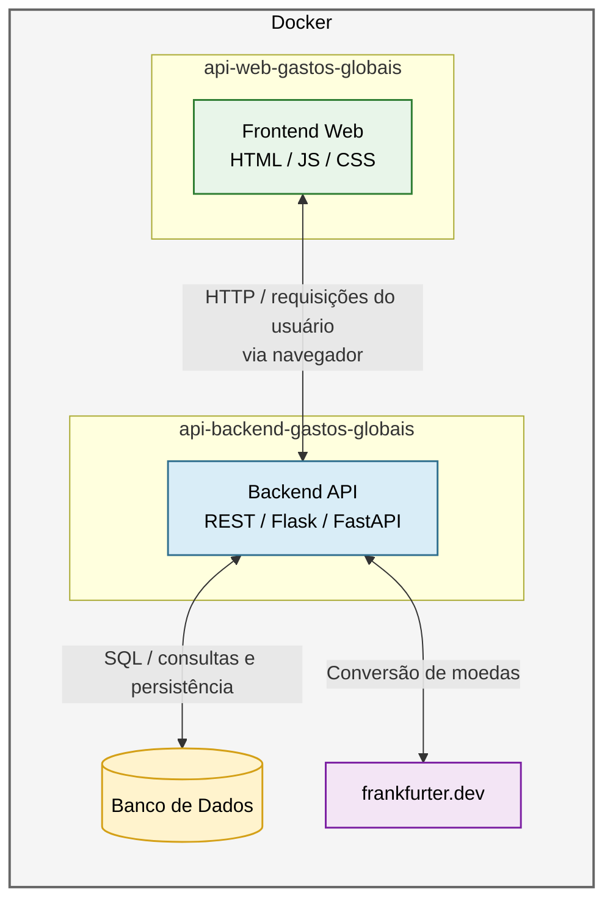

# Gastos Globais Web API

Esse projeto é o desenvolvimento Front-end para a aplicação Gastos Globais, que é o MVP de Desenvolvimento Fullstack do programa de Pósgraduação de 2026 da PUC-Rio

## Fluxo da aplicação



## Como executar

Para executar localmente, basta realizar o download do projeto e abrir o arquivo index.html no seu browser

# Usando o Docker

Para executar a aplicação usando o Docker, siga os passos abaixo:

1. Certifique-se de ter o Docker instalado em sua máquina. Se ainda não tiver, você pode baixá-lo e instalá-lo a partir do site oficial: [Docker](https://www.docker.com/).

2. Clone o repositório para uma pasta de sua preferência, na mesma pasta clone também o frontend da aplicação: [api-backend-gastos-globais](https://github.com/sergio-mpm/api-backend-gastos-globais).

3. Abra o terminal ou prompt de comando e navegue até o diretório criado para abrigar ambos os projetos, onde o arquivo `docker-compose` está localizado.

4. Execute o comando ```docker compose up --build -d```

5. Isso fará com que a aplicação seja carregada dentro de um container do Docker, deverá abrir como ```localhost:8080```.